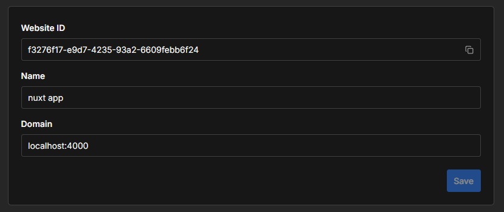
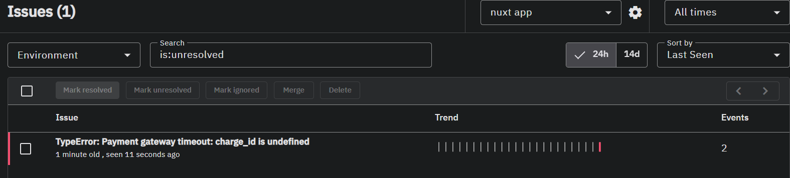
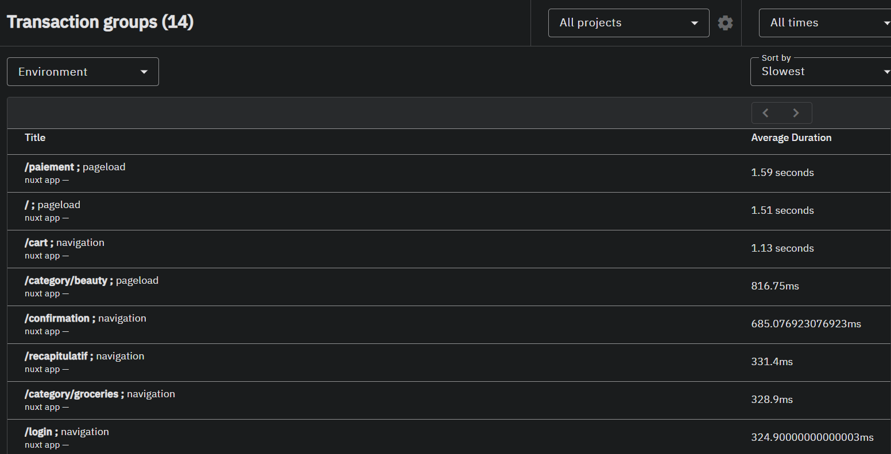
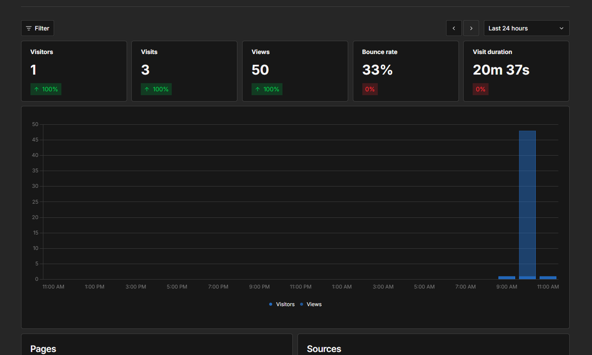
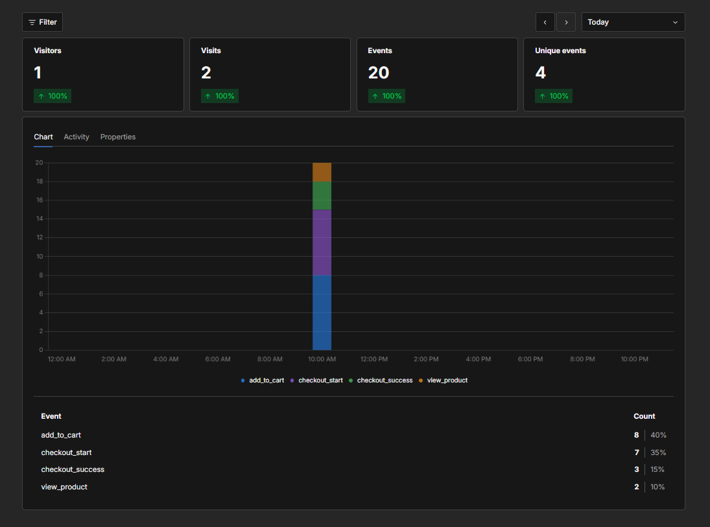
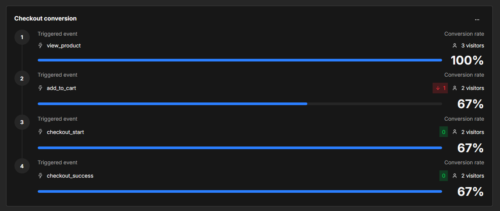
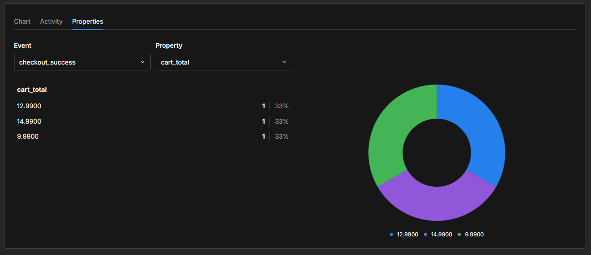
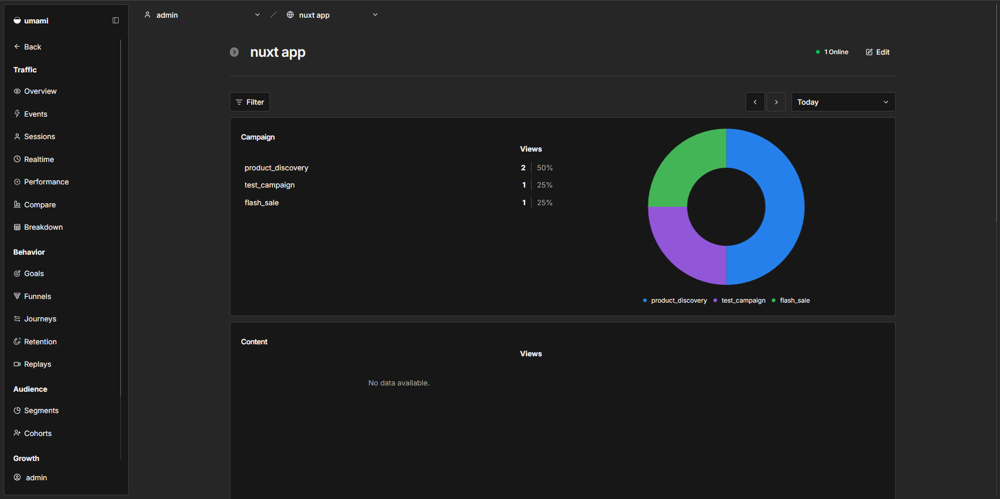
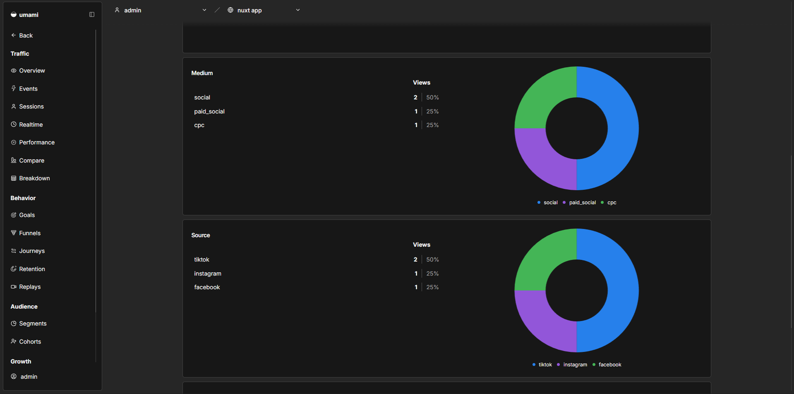

# FooCommerce

> https://github.com/alexy103/projet-analytics

Une application e-commerce réalisée avec Nuxt 4 et Vue.js 3.

## Installation

```bash
git clone git@github.com:alexy103/projet-analytics.git
cd projet-analytics
docker compose up --build -d
```

Une fois le stack démarré :

| Service              | URL                   |
| -------------------- | --------------------- |
| Boutique (Traefik)   | http://localhost      |
| Umami                | http://localhost:3000 |
| GlitchTip            | http://localhost:8000 |
| Adminer              | http://localhost:8080 |
| Tableau bord Traefik | http://localhost:8081 |

L'application n'est pas exposée directement : elle est servie par **Traefik**
sur le port 80. Le routage est déclaré dans `traefik/dynamic.yml` (file
provider), ce qui évite de monter le socket Docker dans le conteneur proxy.

> Umami occupe le port 3000, celui qu'utilise `nuxt dev` par défaut. Pour
> travailler en local pendant que le stack tourne :
> `npm run dev -- --port 3001`.

### Configuration

Le DSN GlitchTip et l'ID de site Umami sont propres à chaque instance : ils ne
sont pas écrits dans le code mais exposés dans `runtimeConfig` (nuxt.config.ts)
et surchargeables par variable d'environnement, sans rebuild. Le service `nuxt`
lit le fichier `.env` à son démarrage.

```bash
cp .env.example .env
```

1. **Umami** — connectez-vous sur http://localhost:3000 (compte par défaut
   `admin` / `umami`), créez un site via _Websites > Add website_, puis
   reportez son identifiant dans `NUXT_PUBLIC_UMAMI_WEBSITE_ID`.
2. **GlitchTip** — créez un compte sur http://localhost:8000, puis une
   organisation, une équipe et un projet. Le DSN complet est affiché dans
   _Settings > Client Keys (DSN)_ ; reportez-le dans
   `NUXT_PUBLIC_GLITCHTIP_DSN`. Le schéma `http://` fait partie du DSN.
3. Appliquez la configuration : `docker compose up -d nuxt`.

### Architecture des services

| Service           | Rôle                                          |
| ----------------- | --------------------------------------------- |
| `traefik`         | Reverse proxy devant l'application (port 80)  |
| `nuxt`            | Application e-commerce (Nuxt 4, non exposée)  |
| `glitchtip`       | Centralisation des erreurs                    |
| `glitchtip-db`    | PostgreSQL dédié à GlitchTip                  |
| `glitchtip-redis` | Valkey — file des tâches de fond de GlitchTip |
| `umami`           | Analytique sans cookies                       |
| `umami-db`        | PostgreSQL dédié à Umami                      |
| `adminer`         | Console d'administration des bases            |

Volumes persistants : `pg-data`, `umami-db-data`, `uploads`, `valkey-data`.



### Structure

```
app/
  components/
    Base/       champ de formulaire réutilisable (BaseField)
    Checkout/   blocs adresse de livraison / facturation
    Icon/       icônes SVG (Bag, Menu, Close, Plus, Minus, ...)
    Product/    vignette, grille, sélecteur de tri, badge catégorie
  composables/  useProducts, useProduct, useCategories, useProductSort,
                useAnalytics, useFormValidation
  stores/       panier (cookie) et authentification
  types/        Product, CartItem, Address, AuthUser, typage de window.umami
  utils/        helpers de validation
server/
  api/          proxy vers DummyJSON + endpoint de commande
  utils/        client DummyJSON basé sur le runtimeConfig
```

### Scripts

```bash
npm run dev           # serveur de développement
npm run build         # build de production
npm run format        # Prettier sur tout le dépôt
npm run format:check  # vérification du formatage
```

## Explications du projet initial

- Catalogue de produits avec filtrage par catégorie
- Page produit détaillée
- Panier persistant (cookie)
- Tunnel de commande (panier → récapitulatif → paiement → confirmation)
- Authentification utilisateur
- Page profil protégée par middleware

### Comptes de test

Les comptes utilisateurs proviennent de l'API DummyJSON. Exemple :

- username: emilys
- password: emilyspass

Liste complète : https://dummyjson.com/users

## Intégration GlitchTip

Le SDK `@sentry/vue` a été intégré via un plugin Nuxt (app/plugins/glitchtip.client.ts). Ce plugin s'initialise côté navigateur et s'accroche au gestionnaire d'erreurs global de Vue, capturant automatiquement toutes les exceptions JavaScript non gérées.

La simulation de panne dans paiement.vue consiste en une promesse rejetée aléatoirement une fois sur trois, envoyée explicitement à GlitchTip via Sentry.captureException(error).

#### Ce que GlitchTip a capturé :

- Type : TypeError
- Message : Payment gateway timeout: charge_id is undefined
- Navigateur : Chrome 148.0.0 sur Windows 10
- Environnement : production
- Breadcrumbs : GlitchTip a enregistré tout le parcours utilisateur avant l'erreur : navigation vers /paiement, remplissage des champs, puis clic sur le bouton "Confirmer la commande" à 10:35:14.

#### Comment un développeur résoudrait cette erreur :

Grâce aux breadcrumbs, le développeur sait exactement ce que l'utilisateur a fait avant le crash. Il identifie que l'erreur survient lors du submit du formulaire de paiement et peut corriger la gestion asynchrone du gateway de paiement.




## Intégration Umami

Umami a également été intégré au projet, permettant de récupérer des données liées à la navigation des utilisateurs.

Ci-dessous le dashboard Umami, qui affiche plusieurs informations comme le nombre de visiteurs uniques, le nombre total de visites, ou encore le taux de rebond.

Ici, on voit que le taux de rebond est de 33%, ce qui pourrait indiquer des soucis de conception au sein de l'application, comme une erreur chez certains utilisateurs ou une page d'accueil très peu attractive.



Sur le dashboard des événements, on peut voir différentes informations utiles, telles que le nombre d'événements déclenchés et le nombre de visites. Ce graphique n'est pas lié au tunnel d'achat, il répertorie uniquement tous les événements.

#### Événements personnalisés



Ici, on peut voir grâce aux événements personnalisés que 3 utilisateurs se sont rendus sur des pages produit, mais seulement 2 ont ajouté le produit en question à leur panier puis ont suivi le tunnel de paiement jusqu'à la fin.



Il est possible d'ajouter des propriétés aux événements personnalisés, comment on peut le voir ici avec la propriété cart_total qui a été ajoutée à l'événement checkout_success.

On peut alors voir le détail des paniers utilisateurs et ainsi calculer le panier moyen, par exemple. Ici, le panier moyen est de 12.65€.



On pourrait imaginer une stratégie de publicité mise en place sur différents réseaux sociaux, et grâce à Umami, il serait possible de visionner la provenance de chaque utilisateur.

Par exemple, en rajoutant ces paramètres au lien de l'application :

`?utm_source=facebook&utm_medium=social&utm_campaign=product_discovery`

Chaque utilisateur cliquant sur ce lien incrémenterait le compteur des paramètres spécifiés. On pourrait alors proposer différents liens en fonction du besoin et des différents partenaires affichant les liens que nous leur fournissons.



