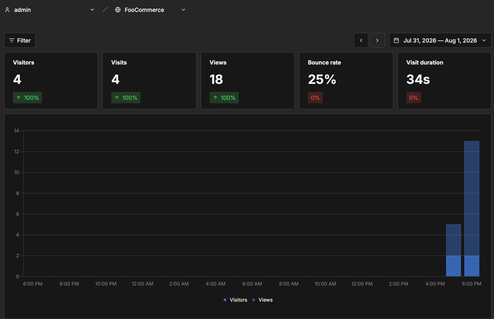
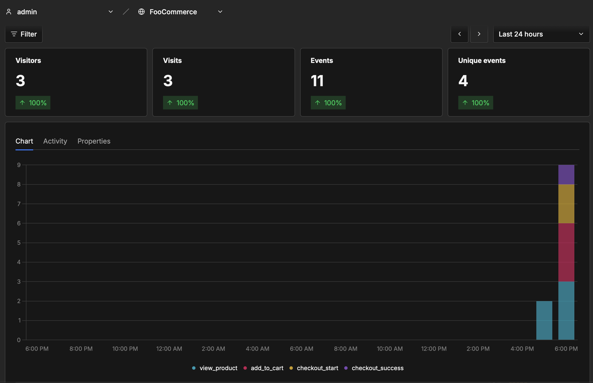
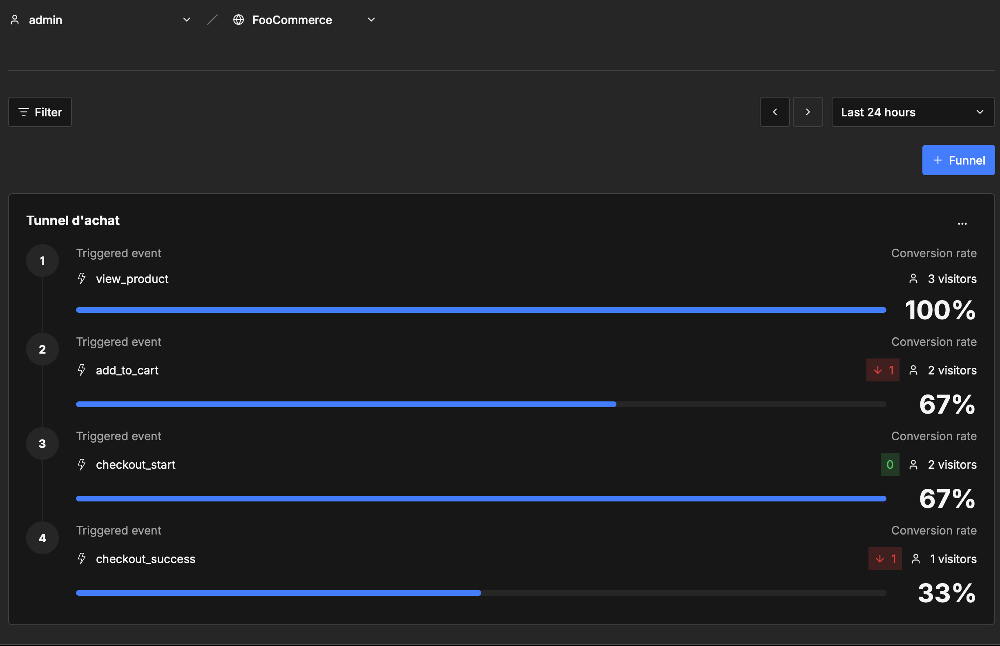
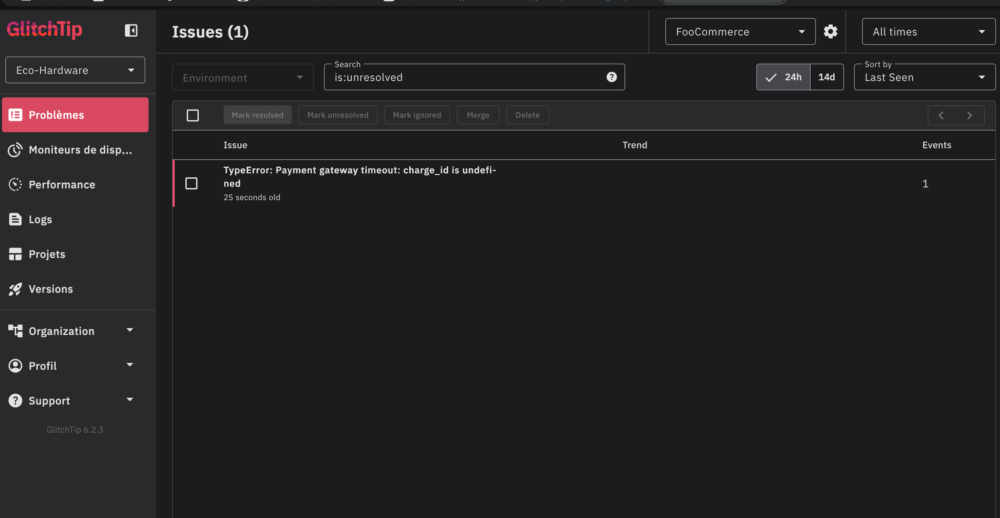

# FooCommerce — E-Shop Monitor

> https://github.com/mohakjo/eshop-monitor

Application e-commerce (Nuxt 4, Vue 3) instrumentée avec une stack
d'observabilité auto-hébergée : **Umami** pour l'analytique du tunnel d'achat et
**GlitchTip** pour la centralisation des erreurs.

## Installation

```bash
git clone git@github.com:mohakjo/eshop-monitor.git
cd eshop-monitor
docker compose up --build -d
```

Une fois le stack démarré :

| Service              | URL                   |
| -------------------- | --------------------- |
| Boutique (Traefik)   | http://localhost      |
| Umami                | http://localhost:3000 |
| GlitchTip            | http://localhost:8000 |
| Adminer              | http://localhost:8080 |
| Tableau bord Traefik | http://localhost:8081 |

L'application n'est pas exposée directement : elle est servie par **Traefik**
sur le port 80. Le routage est déclaré dans `traefik/dynamic.yml` (file
provider), ce qui évite de monter le socket Docker dans le conteneur proxy.

> Umami occupe le port 3000, celui qu'utilise `nuxt dev` par défaut. Pour
> travailler en local pendant que le stack tourne :
> `npm run dev -- --port 3001`.

### Configuration

Le DSN GlitchTip et l'ID de site Umami sont propres à chaque instance : ils ne
sont pas écrits dans le code mais exposés dans `runtimeConfig` (nuxt.config.ts)
et surchargeables par variable d'environnement, sans rebuild. Le service `nuxt`
lit le fichier `.env` à son démarrage.

```bash
cp .env.example .env
```

1. **Umami** — connectez-vous sur http://localhost:3000 (compte par défaut
   `admin` / `umami`), créez un site via _Websites > Add website_, puis
   reportez son identifiant dans `NUXT_PUBLIC_UMAMI_WEBSITE_ID`.
2. **GlitchTip** — créez un compte sur http://localhost:8000, puis une
   organisation, une équipe et un projet. Le DSN complet est affiché dans
   _Settings > Client Keys (DSN)_ ; reportez-le dans
   `NUXT_PUBLIC_GLITCHTIP_DSN`. Le schéma `http://` fait partie du DSN.
3. Appliquez la configuration : `docker compose up -d nuxt`.

### Architecture des services

| Service           | Rôle                                          |
| ----------------- | --------------------------------------------- |
| `traefik`         | Reverse proxy devant l'application (port 80)  |
| `nuxt`            | Application e-commerce (Nuxt 4, non exposée)  |
| `glitchtip`       | Centralisation des erreurs                    |
| `glitchtip-db`    | PostgreSQL dédié à GlitchTip                  |
| `glitchtip-redis` | Valkey — file des tâches de fond de GlitchTip |
| `umami`           | Analytique sans cookies                       |
| `umami-db`        | PostgreSQL dédié à Umami                      |
| `adminer`         | Console d'administration des bases            |

Volumes persistants : `pg-data`, `umami-db-data`, `uploads`, `valkey-data`.

### Structure

```
app/
  components/
    Base/       champ de formulaire réutilisable (BaseField)
    Checkout/   blocs adresse de livraison / facturation
    Icon/       icônes SVG (Bag, Menu, Close, Plus, Minus, ...)
    Product/    vignette, grille, sélecteur de tri, badge catégorie
  composables/  useProducts, useProduct, useCategories, useProductSort,
                useAnalytics, useFormValidation
  stores/       panier (cookie) et authentification
  types/        Product, CartItem, Address, AuthUser, typage de window.umami
  utils/        helpers de validation
server/
  api/          proxy vers DummyJSON + endpoint de commande
  utils/        client DummyJSON basé sur le runtimeConfig
```

### Scripts

```bash
npm run dev           # serveur de développement
npm run build         # build de production
npm run format        # Prettier sur tout le dépôt
npm run format:check  # vérification du formatage
```

## Explications du projet initial

- Catalogue de produits avec filtrage par catégorie
- Page produit détaillée
- Panier persistant (cookie)
- Tunnel de commande (panier → récapitulatif → paiement → confirmation)
- Authentification utilisateur
- Page profil protégée par middleware

### Comptes de test

Les comptes utilisateurs proviennent de l'API DummyJSON. Exemple :

- username: emilys
- password: emilyspass

Liste complète : https://dummyjson.com/users

# Rapport d'observabilité

> Mesures relevées sur l'instance locale, fenêtre « Last 24 hours », après une
> campagne de test de quatre parcours utilisateurs menés chacun dans un
> navigateur distinct (Chrome, Firefox, Safari, Edge). Umami identifiant un
> visiteur par un condensé IP + User-Agent, une fenêtre de navigation privée ne
> compte pas comme un nouveau visiteur : c'est le changement de navigateur qui
> crée le visiteur.

## Intégration Umami

Le tracker est injecté côté navigateur par `app/plugins/umami.client.ts`, qui
charge `script.js` depuis l'instance Umami et lui transmet l'identifiant du
site. Aucun cookie n'est déposé pour l'analytique.

### Métriques standards



| Indicateur               | Valeur   |
| ------------------------ | -------- |
| Visiteurs uniques        | 4        |
| Visites (sessions)       | 4        |
| Pages vues               | 18       |
| Taux de rebond           | **25 %** |
| Durée moyenne de session | **34 s** |

Répartition : `chrome`, `firefox`, `safari`, `edge-chromium` — un visiteur
chacun, tous sur macOS et sur poste fixe/portable.

**Lecture du taux de rebond.** 25 % signifie qu'une session sur quatre s'est
arrêtée sur la page d'accueil sans aucune autre page vue. Sur un catalogue,
c'est un niveau sain : les trois autres sessions ont toutes atteint au moins
une fiche produit. Avec 18 pages vues pour 4 visites, on est à 4,5 pages par
session, ce qui traduit une navigation exploratoire réelle plutôt que des
arrivées accidentelles. Une durée moyenne de 34 s reste courte : elle est
tirée vers le bas par la session ayant rebondi, et par le fait que les
parcours de test étaient dirigés, sans temps de lecture.

### Suivi du tunnel d'achat

Les quatre événements du plan de marquage sont émis depuis
`app/composables/useAnalytics.ts`, qui centralise les noms d'événements et la
construction des propriétés.



Umami enregistre **11 événements** répartis sur **4 événements uniques** — les
quatre étapes du tunnel, et elles seules. Cette vue compte **3 visiteurs** là où
le dashboard en affiche 4 : le quatrième est celui qui a rebondi sur la page
d'accueil, sans jamais déclencher le moindre événement. Les deux chiffres se
recoupent donc exactement avec le taux de rebond de 25 %.



Le même tunnel se lit de trois façons, chacune répondant à une question
différente :

| Étape              | Occurrences | Visiteurs | Conversion depuis l'étape 1 | Passage depuis l'étape précédente |
| ------------------ | ----------- | --------- | --------------------------- | --------------------------------- |
| `view_product`     | 5           | 3         | 100 %                       | —                                 |
| `add_to_cart`      | 3           | 2         | 67 %                        | 67 %                              |
| `checkout_start`   | 2           | 2         | 67 %                        | 100 %                             |
| `checkout_success` | 1           | 1         | 33 %                        | 50 %                              |

- Les **occurrences** comptent les événements émis ; les **visiteurs** comptent
  les personnes distinctes ayant atteint l'étape. L'écart est normal : un même
  visiteur a consulté plusieurs fiches et ajouté plusieurs articles.
- La colonne **conversion depuis l'étape 1** est celle qu'affiche le rapport
  _Funnel_ d'Umami. Elle mesure l'érosion cumulée du tunnel.
- La colonne **passage depuis l'étape précédente** est dérivée de la
  précédente. C'est elle qui localise la fuite, étape par étape.

**Deux taux de conversion, deux lectures.** Rapporté aux 4 visites du site,
une commande aboutie donne une conversion globale de **25 %**. Rapporté aux 3
visiteurs réellement entrés dans le tunnel (ceux qui ont consulté au moins une
fiche produit), le taux de conversion du tunnel est de **33 %** — c'est la
valeur affichée par Umami. La première mesure l'efficacité du site dans son
ensemble, la seconde celle du tunnel une fois l'intérêt manifesté.

**Analyse des abandons.** La première fuite se situe entre la consultation
d'une fiche produit et l'ajout au panier : un visiteur sur trois repart sans
rien mettre au panier, et en volume d'événements deux consultations sur cinq ne
débouchent sur rien. C'est un écart normal en e-commerce (comparaison, simple
curiosité), mais c'est le levier au plus fort volume.

En revanche, **tous les visiteurs ayant rempli un panier ont engagé la
commande** (100 % de passage entre `add_to_cart` et `checkout_start`) : le
panier et l'accès au tunnel ne posent aucun problème d'ergonomie.

La perte la plus préoccupante est donc la dernière : **une commande sur deux se
perd entre `checkout_start` et `checkout_success`**, c'est-à-dire à l'étape de
paiement, et uniquement là. C'est précisément le symptôme décrit par le Product Owner, et il est
corrélé à la panne intermittente du prestataire de paiement simulée dans
`app/pages/paiement.vue` (une tentative sur trois échoue). L'analytique seule
ne permet pas de trancher entre un abandon volontaire et une erreur technique :
c'est le croisement avec GlitchTip qui donne la réponse.

### Métriques métier via les propriétés d'événements

Les événements `checkout_start` et `checkout_success` transportent
`cart_total`, `cart_items_count` et `cart_quantity`, ce qui permet de
reconstituer le détail des paniers :

| Événement          | Panier  | Articles | Unités |
| ------------------ | ------- | -------- | ------ |
| `checkout_start`   | 9,99 €  | 1        | 1      |
| `checkout_start`   | 39,97 € | 2        | 3      |
| `checkout_success` | 39,97 € | 2        | 3      |

**Panier moyen des commandes abouties : 39,97 €** (une commande).

Le rapprochement est parlant : le panier abandonné est le plus petit (9,99 €,
un seul article), celui qui va au bout est le plus gros. Sur un volume réel, on
vérifierait si les petits paniers abandonnent davantage — auquel cas un seuil
de livraison gratuite serait le levier naturel.

> ⚠️ La moyenne porte ici sur **une seule commande** : elle est illustrative de
> la mécanique de mesure, pas statistiquement significative.

### Suivi de l'origine du trafic

Umami classe nativement les visiteurs par référent et par paramètres UTM. En
diffusant l'application derrière un lien de campagne :

```
http://localhost/?utm_source=facebook&utm_medium=social&utm_campaign=product_discovery
```

chaque clic alimente les rapports _Referrers_ et _Campaigns_, ce qui permet
d'attribuer les conversions à une source et de comparer le panier moyen entre
canaux.

> Aucune campagne n'a été jouée pendant cette session de test : les rapports
> UTM sont donc vides sur les relevés ci-dessus.

## Intégration GlitchTip

Le SDK `@sentry/vue` est initialisé côté navigateur par
`app/plugins/glitchtip.client.ts`. Il s'accroche au gestionnaire d'erreurs
global de Vue et remonte automatiquement toute exception JavaScript non gérée,
avec le navigateur, le système d'exploitation, la pile d'appels et les
breadcrumbs du parcours précédant l'incident.

### Simulation de panne

`app/pages/paiement.vue` simule une défaillance du prestataire de paiement : la
fonction `chargeCard()` lève une `TypeError` une fois sur trois, capturée puis
transmise explicitement par `Sentry.captureException(error)`.

```
TypeError: Payment gateway timeout: charge_id is undefined
```

Pour la déclencher : ouvrir `/paiement`, renseigner les champs puis valider. En
cas de succès l'utilisateur est redirigé vers `/confirmation` ; il faut donc
revenir sur la page pour retenter, jusqu'à tomber sur l'échec.

### Ce que GlitchTip a capturé



_Vue « Event Details » de l'incident `FOOCOMMERCE-3` : identification de
l'exception, contexte d'exécution et tags. La pile d'appels et les breadcrumbs
figurent plus bas sur la même page._

| Champ         | Valeur relevée                                    |
| ------------- | ------------------------------------------------- |
| Type          | `TypeError`                                       |
| Message       | `Payment gateway timeout: charge_id is undefined` |
| Page fautive  | `/paiement`                                       |
| Navigateur    | Safari 26.1                                       |
| Système       | Mac OS X 10.15.7                                  |
| Environnement | `production`                                      |
| Mécanisme     | `generic`, `handled: yes`                         |
| Breadcrumbs   | 45 entrées                                        |

Le marqueur `handled: yes` confirme que l'exception a été interceptée puis
transmise volontairement par `Sentry.captureException()`, et non collectée par
le gestionnaire global — c'est bien la simulation de panne qui est remontée.

Les 45 breadcrumbs rejouent la fin du parcours dans l'ordre : clics et saisies
successives dans les champs du formulaire de paiement, puis clic sur le bouton
`[type="submit"]` — soit « Confirmer la commande ». L'incident est donc
formellement rattaché à la validation du paiement, et non au rendu de la page.

### Données personnelles

Le projet GlitchTip a l'option `scrubIPAddresses` activée : l'adresse IP visible
sur la capture (`172.67.205.0`) est tronquée sur son dernier octet, elle ne
permet pas de réidentifier le visiteur. Côté Umami, l'analytique fonctionne sans
cookie et aucun identifiant personnel n'est transmis : les propriétés
d'événements ne portent que des données produit (`product_id`, `product_price`)
et des agrégats de panier (`cart_total`, `cart_quantity`). Les champs du
formulaire de commande — nom, e-mail, adresse — ne sont envoyés à aucun des deux
services.

> **Limite constatée.** La pile d'appels renvoyée pointe sur le bundle minifié
> (`/_nuxt/DKuZrCb0.js`, fonctions `p` et `c`) : sans _source maps_ transmises à
> GlitchTip, les noms d'origine `chargeCard()` et `onSubmit()` n'apparaissent
> pas. C'est le prolongement naturel de cette intégration : publier les source
> maps du build (via `sentry-cli` ou l'option `sourcemap` de Nuxt) rendrait la
> pile directement lisible et pointerait la ligne exacte de `paiement.vue`.

### Suivi de performance

`app/composables/usePageLoadSpan.ts` mesure le temps de chargement des deux
étapes du tunnel qui portent un formulaire, via les spans
`checkout-summary-load` (récapitulatif) et `checkout-payment-load` (paiement).
Le span s'ouvre pendant le `setup()` du composant et se ferme après la première
frame effectivement peinte, de façon à mesurer le délai réellement perçu par
l'utilisateur.

### Exploitation par un développeur

Sans GlitchTip, ce bug est un cauchemar : il ne survient qu'une fois sur trois,
ne laisse aucune trace serveur puisqu'il se produit entièrement dans le
navigateur, et l'utilisateur qui le rencontre abandonne sans rien signaler.

Avec l'incident remonté, le développeur dispose de trois éléments immédiats.
Le **message** nomme la cause probable — une réponse du prestataire sans
`charge_id`, donc un appel qui n'a pas abouti. Les **breadcrumbs** prouvent que
l'échec suit le clic sur « Confirmer la commande » et non le chargement de la
page : le formulaire et sa validation sont hors de cause. Le **contexte**
(Safari 26.1, Mac OS X, environnement `production`) permet de vérifier s'il
s'agit d'un problème spécifique à un navigateur — ici il faudrait plusieurs
occurrences pour trancher.

La correction porte donc sur la fiabilisation de l'appel au prestataire :
délai d'attente explicite, reprise sur erreur, et surtout un message
utilisateur qui invite à réessayer plutôt que de laisser la commande en
suspens. Le champ `charge_id` non défini indique par ailleurs qu'il faut
valider la réponse du prestataire avant de la consommer.

C'est aussi ce qui permet de qualifier la fuite de 50 % observée à la dernière
étape du tunnel Umami : si le volume d'incidents GlitchTip suit celui des
`checkout_start` non convertis, l'abandon est technique et non commercial.
